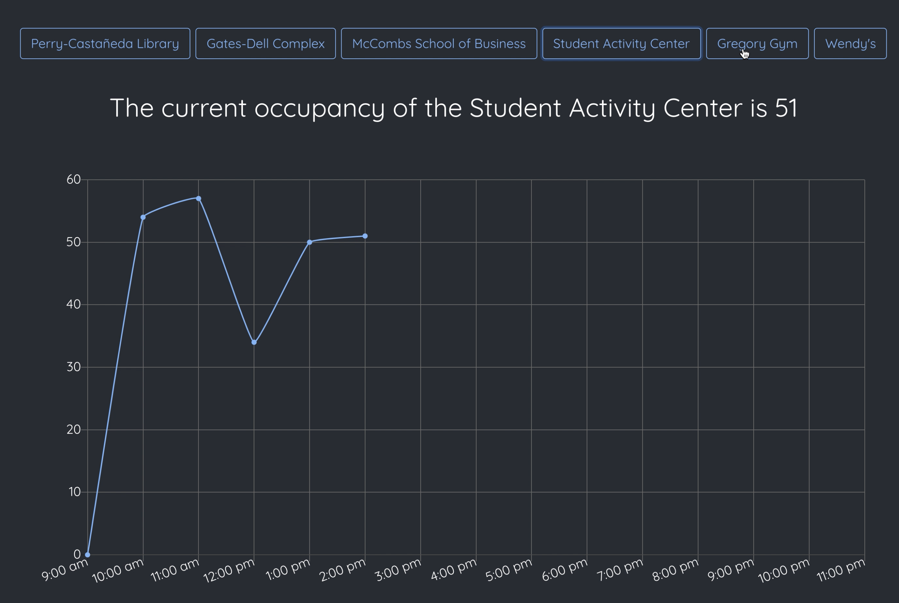
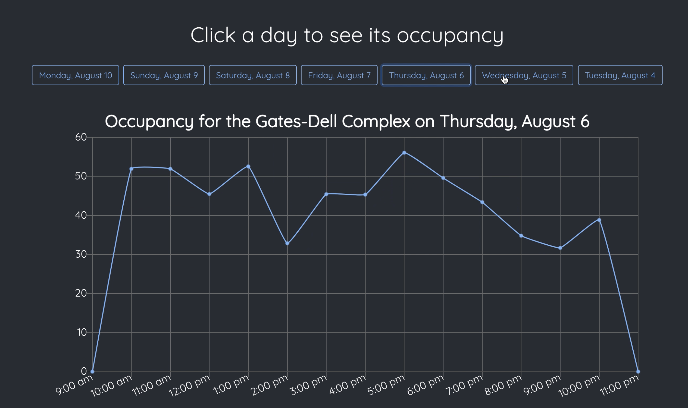
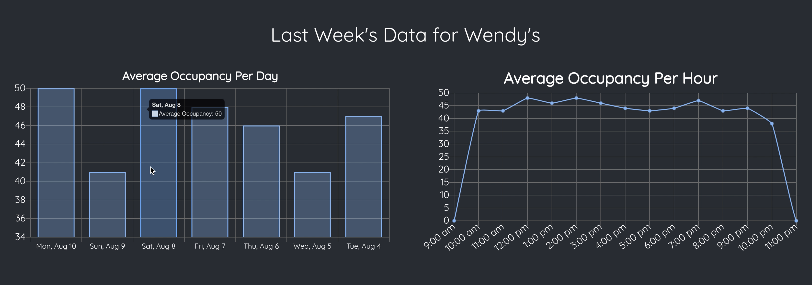

# Occupansee

**Occupansee** is a program that can calculate the number of people inside of a building given a video feed, usually from a security camera. The current occupancy and other related statistics are displayed on this [website](https://occupansee.web.app/) in real-time.

[View the demo video](https://www.youtube.com/watch?v=x7GwwBdKOxU)

## Occupancy Calculation 
The occupancy of a building can be calculated in two different ways depending on the size of the building. First, people (or object) detection is performed using the [YOLO](https://pjreddie.com/darknet/yolo/) convolutional neural network algorithm trained on the [CoCo](https://cocodataset.org/#home) dataset. Note that the weights from the YOLO algorithm are not included because of their large file sizes, but can be found here In addition, [OpenCV](https://opencv.org/) is used for general video processing and computer vision related tasks. 

### Small Buildings
If the building is small enough where the camera can capture the entire building or location of interest, then the occupancy is simply the number of people detected. 

### Large Buildings
If the building is large, the video feed should be from a camera positioned at the entrance of the building. Then, in addition to detecting people, Occupansee tracks the people’s movements to determine which direction they are moving in and which side of the frame they exit from. The user will configure which side of the frame will be considered the “entrance” and which will be considered the “exit”, and the occupancy is calculated by taking the difference between people entering and exiting. 

Because people are identified using a YOLO-based Convolutional Neural Network which is computationally expensive, the counter for the number of people is updated every 150 frames, while the number of people exiting each side is updated immediately.

## Database 
The data is sent to a [Firebase Realtime Database](https://firebase.google.com/docs/database), where it is stored in a nosql format. The keys correspond to when the data was collected, allowing for specific and efficient data retrieval. This will simplify the process of calculating statistics from a specific time frame, such as the previous hour, day, or week.

## Websockets
Once per day, data is queried, statistics are calculated, and both are send to the front end using [websockets](https://developer.mozilla.org/en-US/docs/Web/API/WebSockets_API). In addition, when the data is generated in real-time, it is also sent to the front end using another websocket (as well as to the database). 

## Front End
The front end was created using [React.js](https://reactjs.org/) and [Chart.js](https://www.chartjs.org/). It displays data for several different locations, including the real-time daily charts, averages of the last week, and the daily charts for the last seven days, all for each location. Thus, changing the location will update all of the graphs on the page to correspond with the newly selected location. 

